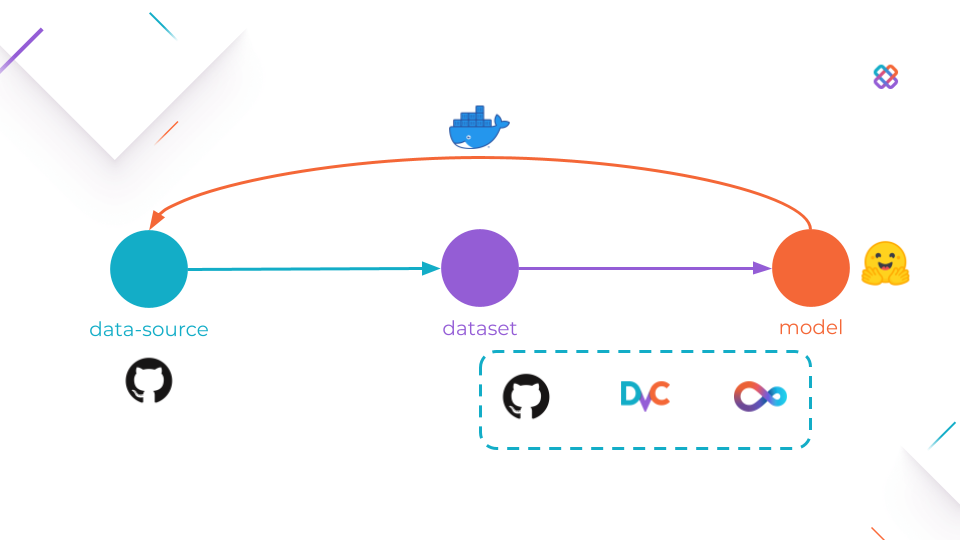
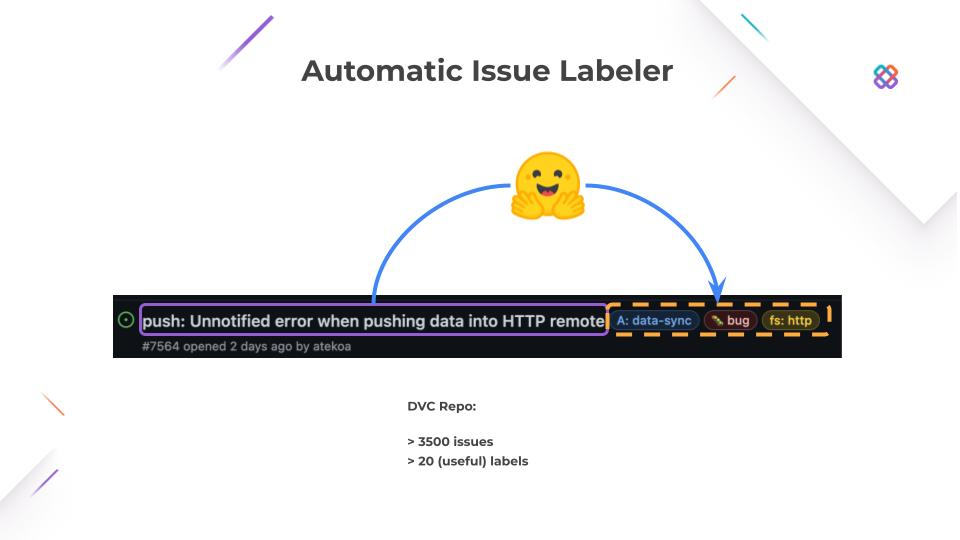

# workshop-uncool-mlops





- :star: -> https://github.com/iterative/dvc
- :star: -> https://github.com/iterative/dvclive
- :star: -> https://github.com/iterative/cml
- :star: -> https://github.com/huggingface/transformerss

# Before we start

- Fork this repo https://github.com/iterative/workshop-uncool-mlops
- Clone **your fork**.

- Intall:

```console
$ python -m venv .venv
$ source .venv/bin/activate
$ python -m pip install --upgrade pip
$ pip install wheel
$ pip install -r requirements.txt
```

- Create a [GitHub personal access token](https://docs.github.com/en/authentication/keeping-your-account-and-data-secure/creating-a-personal-access-token)

```console
$ export GITHUB_TOKEN={YOUR_GITHUB_TOKEN}
```

# Current status

1. [Local Reproducibility](./docs/1-local-reproducibility.md)

# Workshop

2. [Shared Reproducibility](./docs/2-shared-reproducibility.md)

3. [Online Reproducibility](./docs/3-online-reproducibility.md)

4. [Deployment](./docs/4-deployment.md)

5. [Automation](./docs/5-automation.md)
