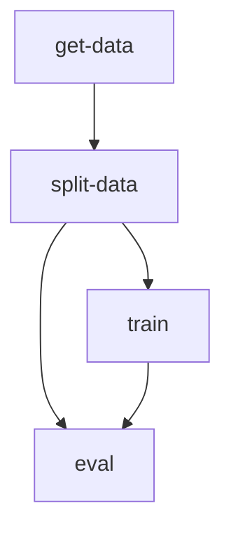
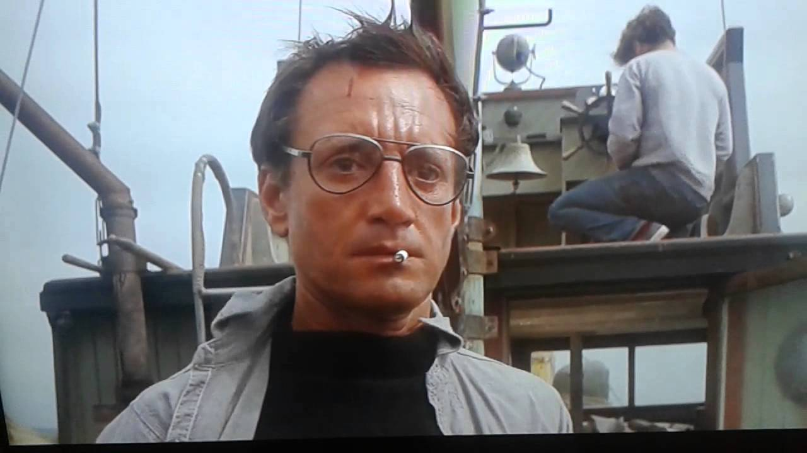

# Local reproducibility

We have a [DVC Pipeline](https://dvc.org/doc/user-guide/project-structure/pipelines-files) defined in [dvc.yaml file](../dvc.yaml).

The pipeline is composed of stages using Python scripts, defined in [src](../src/):



We use [DVC Params](https://dvc.org/doc/command-reference/params), defined in [params.yaml](../params.yaml), to configure the pipeline.

The pipeline enables local `reproducibility` and can be run with `dvc repro`:

```console
git clone git@git@github.com:iterative/workshop-uncool-mlops.git
cd workshop-uncool-mlops
```

```console
pip install -r requirements.txt
```

```console
dvc repro
```


The pipeline generates [DVC Metrics](https://dvc.org/doc/command-reference/metrics) and [DVC Plots](https://dvc.org/doc/command-reference/plots) to evaluate model performance, which can be found in [outs](../outs)

You can connect the repo with https://studio.iterative.ai/ in order to have a better visualization for the metrics, parameters and plots associated to each commit:

https://studio.iterative.ai/user/daavoo/views/workshop-uncool-mlops-5fgmd70rkt

Because the metrics and plots files are small enough to be tracked by `git`, after we run the pipeline we can share the results with others:

```
git add `dvc.lock` outs
git push
```

However, the rest of the outputs are gitignored because they are too big to be tracked by `git`.


