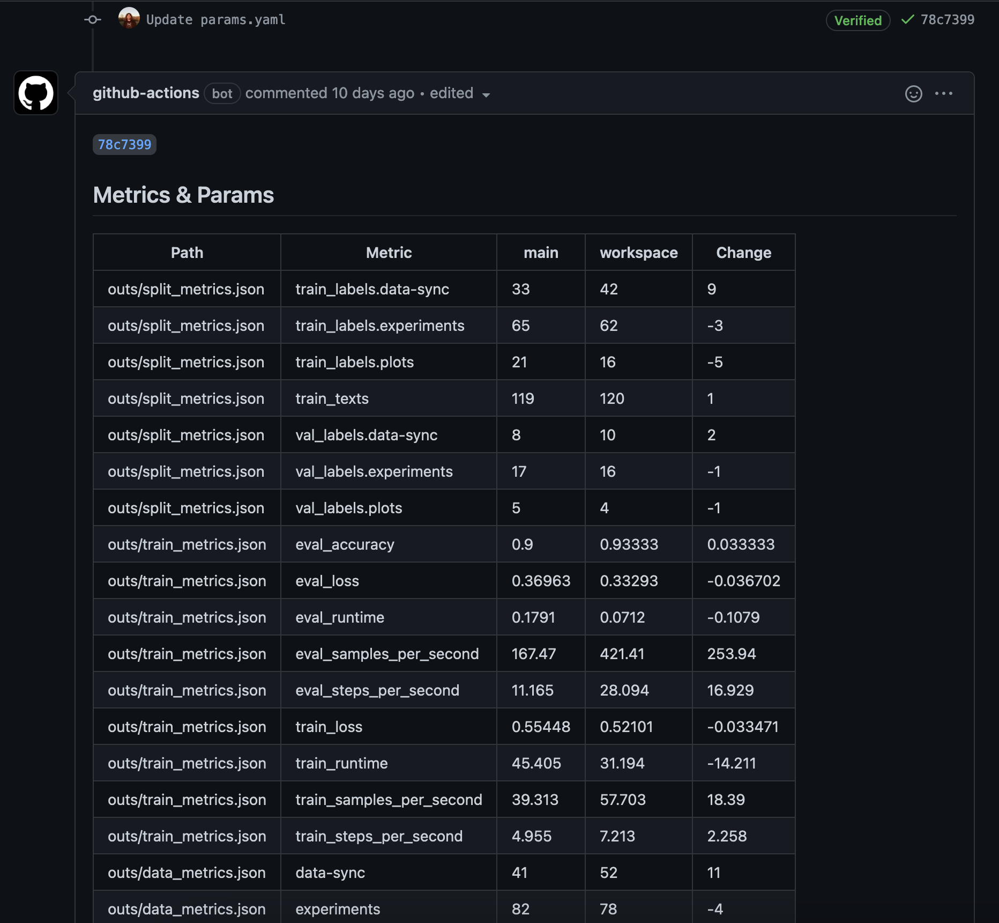
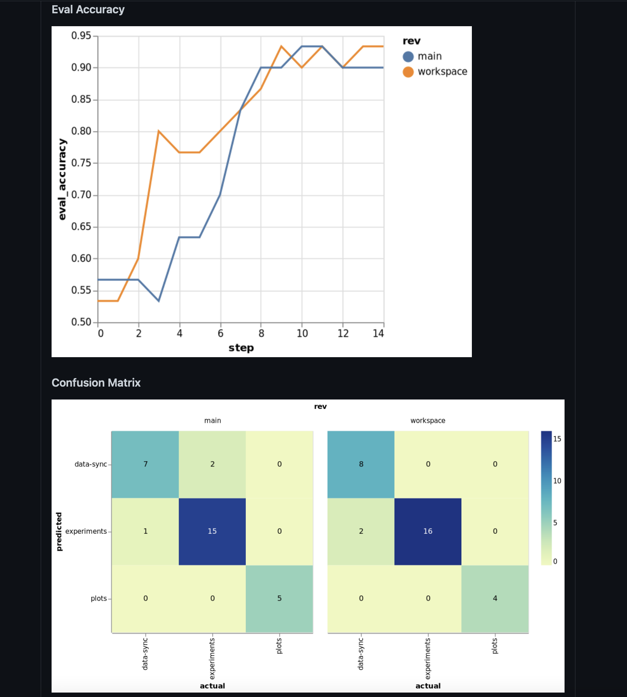

# Online Reproducibility

## GitHub Personal access x Token

- Create a personal access token

https://docs.github.com/en/authentication/keeping-your-account-and-data-secure/creating-a-personal-access-token

- Create a new secret and name it `PERSONAL_GITHUB_TOKEN`

## Grant GitHub access to DVC Remote

You need to grant GitHub access to the DVC Remote.

Get the credentials.

<details>
<summary>From web</summary>

https://colab.research.google.com/drive/1Xe96hFDCrzL-Vt4Zj-cVHOxUgu-fyuBW

</details>

<details>
<summary>From CLI</summary>

```bash
cat ".dvc/tmp/gdrive-user-credentials.json"
```

</details>


And create a new GitHub secret `GDRIVE_CREDENTIALS_DATA` to store them.

With this, GitHub runners will be able to pull and push all the changes generated by the pipeline.

## Pull Request workflow

You can create a new *GitHub actions workflow* that runs when a new Pull Request is created.

This workflow will use `DVC` to reproduce the pipeline and update the large artifacts tracked by DVC.

In addition it will use `CML` to post a **report** with the `DVC` metrics, params, and plots ([cml send-comment](https://cml.dev/doc/ref/send-comment)). It will also update the artifacts tracked by Git ([cml pr](https://cml.dev/doc/ref/pr))





<details>
<summary>Create and fill `.github/workflows/on_pr.yml`</summary>

```yaml
name: DVC & CML Workflow

on:
  pull_request:

  # Allows you to run this workflow manually from the Actions tab
  workflow_dispatch:

jobs:
  build:
    runs-on: ubuntu-latest
    container: docker://ghcr.io/iterative/cml:latest

    steps:
      - uses: actions/checkout@v2
        with:
          fetch-depth: 0

      - name: Setup
        run: |
          pip install -r requirements.txt

      - name: Run DVC pipeline
        env:
          GITHUB_TOKEN: ${{ secrets.PERSONAL_GITHUB_TOKEN }}
          GDRIVE_CREDENTIALS_DATA: ${{ secrets.GDRIVE_CREDENTIALS_DATA }}
        run: |
          dvc repro --pull

      - name: Share changes
        env:
          GDRIVE_CREDENTIALS_DATA: ${{ secrets.GDRIVE_CREDENTIALS_DATA }}
        run: |
          dvc push

      - name: Create a P.R. with CML 
        env:
          REPO_TOKEN: ${{ secrets.GITHUB_TOKEN }}
        run: |
          cml pr --auto-merge "dvc.lock" "outs/*.json" "outs/eval"  "outs/train_metrics"

      - name: CML Report
        env:
          REPO_TOKEN: ${{ secrets.GITHUB_TOKEN }}
        run: |
          echo "## Metrics & Params" >> report.md

          dvc exp diff main --show-md >> report.md
          cml send-comment --pr --update report.md
                  
          echo "## Plots" >> report.md

          echo "### Eval Loss" >> report.md
          dvc plots diff \
            --target outs/train_metrics/scalars/eval_loss.tsv --show-vega main > vega.json
          vl2png vega.json -s 1.5 | cml-publish --md  >> report.md

          echo "### Eval Accuracy" >> report.md
          dvc plots diff \
            --target outs/train_metrics/scalars/eval_accuracy.tsv --show-vega main > vega.json
          vl2png vega.json -s 1.5 | cml-publish --md  >> report.md

          echo "### Confusion Matrix" >> report.md
          dvc plots diff \
            --target outs/eval/plots/confusion_matrix.json --show-vega main > vega.json
          vl2png vega.json -s 1.5 | cml-publish --md  >> report.md

          cml send-comment --pr --update report.md
```
</details>

## Reproduce Online

And now you can reproduce the pipeline from the web:

### From GitHub UI

- Edit `params.yaml` from the GitHub Interface.

- Change `train.epochs`.

- Select `Create a new branch for this commit and start a pull request`

### From Studio

- Go to https://studio.iterative.ai (It's free)
- Connect your GitHub account.
- Add a new view.

> More info: https://dvc.org/doc/studio

- Click on `Run new experiment` button.

## More compute

In the above workflow we are using the default GitHub runners to train our model.

While this is enough for our use case (small dataset, small model), your project would often require more compute resources.

[CML Self-Hosted Runners](https://cml.dev/doc/self-hosted-runners) allows you to allocate cloud instances (or on-premise machines) and use them in your GitHub actions workflow.
