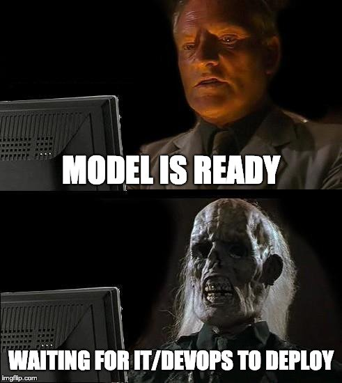

# Deployment

Now that GitHub has access to our DVC Remote, we can automate the deploymend of our model.



In our case, we will create a workflow that builds a docker image and deploys it to [GitHub's Container registry](https://docs.github.com/en/packages/working-with-a-github-packages-registry/working-with-the-container-registry).

First, we create a Dockerfile that wraps our model and uses the [inference script](../src/inference.py)

<details>
<summary>Create and fill `Dockerfile`</summary>

https://github.com/iterative/workshop-uncool-mlops-solution/blob/main/Dockerfile

</details>

Now, we can create a new GitHub workflow that gets the latest model from the DVC remote, builds a new image and
publish it to the container registry.

<details>
<summary>Create and fill `.github/workflows/deploy_model.yml`</summary>

https://github.com/iterative/workshop-uncool-mlops-solution/blob/main/.github/workflows/deploy_model.yaml

</details>

Once this has been merged and the first image published, we can use it from anywhere:

```console
docker run "ghcr.io/iterative/workshop-uncool-mlops-solution:main" "dvc pull fails when using my S3 remote"
{"label": "data-sync", "score": 0.8273094296455383}
```

This also allows to use the image inside other GitHub workflows. We can create a new workflow that gets triggered
whenever a new issue is created and uses the wrapped model to automatically assign a new label:

<details>
<summary>Create and fill `.github/workflows/issue_labeler.yml`</summary>

https://github.com/iterative/workshop-uncool-mlops-solution/blob/main/.github/workflows/issue_labeler.yaml

</details>

Create a new issue and check the workflow and the added label.
